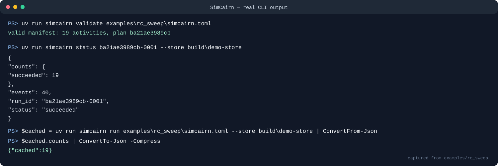

# SimCairn

[](https://github.com/appleweiping/SimCairn/actions/workflows/ci.yml)
[](https://github.com/appleweiping/SimCairn/actions/workflows/codeql.yml)
[](https://www.python.org/)
[](LICENSE)

SimCairn is a local-first activity orchestrator for reproducible SPICE sweeps.
It compiles a strict TOML manifest into an immutable activity DAG, runs bounded
simulator subprocesses without a shell, stores content-addressed artifacts, and
records progress in an append-only journal that can be resumed after a failed
or interrupted run.

Each cached activity is a cairn: a verifiable marker showing exactly which
inputs, sweep point, adapter identity, environment, dependencies, and artifacts
produced a result.

## Features

- Product and zip sweep expansion with stable point order.
- Strict, non-executable `@{parameter}` deck substitution.
- `render → simulate → extract` chains per sweep point and one aggregate task.
- Bounded asynchronous execution and named resource limits.
- Simulator commands launched as argv arrays with `shell=False` semantics.
- Explicit subprocess environment allowlist, timeout, terminate, and kill.
- SHA-256 input and artifact verification.
- Atomic content-addressed cache publication.
- Append-only, fsync-backed JSONL run journals.
- Recovery of an incomplete final journal record and replay of verified cache.
- A deterministic RC subprocess for examples and CI.
- An ngspice batch adapter for decks that emit requested `.measure` values.
- Offline, content-pinned SKY130A and GF180MCU 27-point PVT materializers.
- Stable JSON and CSV result collection.
- Store survey, whole-store verification, and a garbage collector that reports
  before it removes and refuses to act on anything it cannot account for.

## RC PVT reference and regression contract

[`examples/rc_pvt`](examples/rc_pvt) contains parallel real-ngspice and
offline analytic-mock manifests over the same 32 process-scale, voltage,
temperature, resistance, and capacitance cases. Aggregate activities now emit
`regression-bundle.json` using the versioned
`regressistor.measurement-bundle/2` contract with manifest-declared units and
the exact producing package, validator implementation, and simulator-adapter
source identity.

The checked-in fixtures clearly distinguish real ngspice-42 output from the
project-generated mock. See [`docs/validation.md`](docs/validation.md) and
[`benchmarks/manifest.json`](benchmarks/manifest.json) for commands and hashes.
Bundle version 2 is a deliberate breaking contract: version-1 inputs are
rejected rather than silently treated as producer-authenticated evidence.
Frozen bundles keep the producer and aggregate identities of the run that
recorded them. Fresh reference checks separately require the actual bundle to
match the currently imported source and current fixed plan, then compare
cases, units, and numeric values. Historical evidence is never relabelled just
to make a newer release hash match it.

The GF180MCU integration also publishes a real 27-point
`regressistor.measurement-bundle/2` artifact. Its PDK, simulator, physical
invariants, and hashes are recorded in
[`docs/gf180-validation.md`](docs/gf180-validation.md) and
[`benchmarks/gf180-manifest.json`](benchmarks/gf180-manifest.json).
- No runtime Python dependencies.

## Installation

SimCairn requires Python 3.11 or newer.

```bash
python -m pip install .
simcairn --version
```

Developer installation:

```bash
python -m pip install -e ".[dev]"
ruff check .
ruff format --check .
mypy src
bandit -q -r src
pytest --cov=simcairn --cov-report=term-missing
python -m build
```

## Run the example

The example is synthetic and contains no PDK or proprietary model data. Its
mock adapter runs in a real child process and calculates the textbook RC cutoff
frequency `1 / (2πRC)`.



```bash
simcairn validate examples/rc_sweep/simcairn.toml
simcairn plan examples/rc_sweep/simcairn.toml
simcairn run examples/rc_sweep/simcairn.toml --store build/demo-store
```

The six `R × C` points create 19 activities:

- six render activities;
- six simulator activities;
- six extraction activities;
- one aggregation activity.

The run command prints a run ID. Inspect and collect it with:

```bash
simcairn status RUN_ID --store build/demo-store
simcairn collect RUN_ID --store build/demo-store -o build/results.json
```

Starting the same manifest again creates a separate run journal but reuses all
19 verified cache entries. A cache entry is accepted only when every declared
artifact still has its recorded size and SHA-256 digest.

## Manifest

```toml
version = 1

[simulator]
adapter = "mock-rc"

[template]
deck = "rc_lowpass.sp.tmpl"
inputs = []

[sweep]
mode = "product"
R = ["1k", "2k", "4k"]
C = ["1n", "2n"]

[run]
timeout_seconds = 20
jobs = 3
fail_fast = false

[run.resources]
simulator = 2

[[measure]]
name = "cutoff_hz"
source = "metrics.json"
field = "cutoff_hz"
```

### Simulator

Supported adapters are:

- `mock-rc`, the deterministic example subprocess;
- `ngspice`, which invokes `ngspice -b -o ngspice_output.log deck.sp`.

For ngspice, set `executable` when it is not discoverable as `ngspice`:

```toml
[simulator]
adapter = "ngspice"
executable = "/opt/ngspice/bin/ngspice"
```

The adapter fingerprints the normalized `ngspice-N[.N...]` token from the
`--version` banner during planning; decorative banner lines are ignored.
Requested measure fields are parsed from `name = numeric_value` lines in
ngspice's batch log. Tests do not require ngspice to be installed.

An optional `[simulator.environment]` table supplies explicit child-process
environment values. SimCairn otherwise passes only basic executable and
temporary-directory variables required by the operating system. Ambient API
tokens and unrelated secrets are not inherited.

### Template and inputs

The deck is UTF-8 text. Placeholders contain an identifier only:

```spice
.param R_VALUE=@{R} C_VALUE=@{C}
```

Substitution is literal. Expressions, recursive templates, newlines, and
undeclared or unused sweep parameters are rejected.

Every deck and input file must remain within the manifest directory after
canonical path resolution. Additional input files are copied into each render
artifact using their manifest-relative path, so a deck may refer to a declared
file such as `models/device.inc`. Input content, not mtime, controls cache keys.

### Sweeps

`mode = "product"` creates the Cartesian product in declaration and array
order. `mode = "zip"` pairs arrays element by element and requires equal
lengths. Duplicate canonical points are errors.

Sweep values must be finite scalar TOML values or strings containing only
letters, digits, `.`, `_`, `+`, and `-`. This prevents a parameter from
inserting whitespace or additional SPICE cards.

### Resources and failure policy

`jobs` bounds total active activities. Named resource limits provide an
additional semaphore. Simulator activities request one `simulator` slot; when
not configured explicitly, its limit defaults to `jobs`.

With `fail_fast = false`, failure skips descendants but independent sweep
points continue. With `true`, pending work is skipped after the first observed
failure.

### Measurements

Each measure maps a public result name to one finite numeric field in a JSON
artifact. The current adapters produce `metrics.json`. Missing, Boolean, NaN,
and infinite values fail extraction rather than entering a result table.

## CLI

```text
simcairn validate MANIFEST
simcairn plan MANIFEST
simcairn run MANIFEST [--jobs N] [--store PATH]
simcairn resume RUN_ID [--store PATH]
simcairn status RUN_ID [--store PATH]
simcairn collect RUN_ID [--store PATH] [-o OUTPUT]
simcairn explain ACTIVITY_ID [--store PATH]
simcairn unlock RUN_ID [--store PATH] [--force]
simcairn store-status [--store PATH]
simcairn store-verify [--store PATH]
simcairn store-gc [--store PATH] [--keep-runs N] [--apply]
                  [--include-unreadable] [--keep-work]
simcairn configure-sky130 DECISION OUTPUT [TRUST ANCHORS] --pdk-root PATH
simcairn configure-gf180 DECISION OUTPUT [TRUST ANCHORS] --pdk-root PATH
```

Exit status is 0 for success, 1 for a completed failed run or cache miss from
`explain`, 2 for invalid input, store, journal, or CLI values, and 3 for a
store check that found a corrupt cairn or a collection that could not remove
everything it planned to.

## Store maintenance

A cairn store only grows. Entries outlive the run that published them on
purpose, which is the point of a cache and also the reason the directory
becomes the largest thing on the disk.

```console
simcairn store-status                 # what is here, and how large
simcairn store-verify                 # re-check every cairn against its manifest
simcairn store-gc                     # what could be reclaimed; removes nothing
simcairn store-gc --apply             # actually reclaim it
```

`store-verify` re-hashes every published artifact. Bit rot in a cached result
is otherwise noticed only when a run silently reuses it. It exits 3 when any
cairn no longer matches its manifest.

### What garbage collection will not do

Reclaiming is the part that has to be careful, because the failure is silent
and permanent: an entry removed while something still needs it turns a cache
hit into a re-simulation at best and a broken resume at worst. Four rules keep
that from happening.

**Nothing is removed unless asked.** `store-gc` reports a plan and changes
nothing. Only `--apply` deletes, and only what the plan named.

**A run that might still be running is untouchable**, and so is everything it
references, whatever its age. A lock is judged live unless it is *positively*
stale: a lock held on another host, or one whose owner cannot be identified,
counts as live. The uncertain case has to be the safe one. The plan is
re-checked as it is applied: a run that acquired a lock is skipped, surviving
plans are reloaded before cache deletion, and work is retained when a live lock
appeared.

Run creation and lock acquisition publish short reader leases; collection
holds the exclusive writer lease and takes a fresh survey. Existing
simulations continue while collection runs because their visible per-run locks
protect plans, cache entries, and work. Lock release is atomic and does not
wait for collection. New run IDs include a 128-bit generation suffix, so a
stale plan cannot name a later run after the original directory was removed.
Existing numeric run IDs remain readable.

**An entry that cannot be read is kept**, not swept up. A corrupt cairn is
evidence about a failure someone may want to look at, and deleting evidence to
reclaim a few megabytes is the wrong trade. `--include-unreadable` overrides
this.

**A run whose plan will not parse blocks collection entirely.** Retaining that
run is not enough on its own: the list of activities it refers to comes back
empty, and an empty list reads exactly like "refers to nothing". Believing it
would mark every entry in the store orphaned and remove all of them. While any
retained run cannot be read, no entry is collectable and the plan says so.

Work sandboxes are removed only when no run in the store holds a live lock,
because a sandbox carries no record of which run owns it.

Before the first deletion, every planned name and the `runs`, `cache`, and
`work` roots are validated; validation is repeated under the writer lease.
Traversal, symbolic-link, and junction redirection fail closed.

`--keep-runs N` sets how many recent runs survive; a locked run survives
regardless.

## Python API

```python
from simcairn import Runner, compile_plan, configure_gf180, configure_sky130, load_manifest

manifest = load_manifest("examples/rc_sweep/simcairn.toml")
plan = compile_plan(manifest)

runner = Runner("build/my-store")
report = runner.run(plan)
print(report.run_id, report.counts)
print(runner.collect(report.run_id))

# A stopped or failed run reuses every still-valid activity:
resumed = runner.resume(report.run_id)
```

## Cache and journal model

An activity key covers its kind, sweep point, dependency keys, logical input
names and hashes, adapter identity, requested measurements, explicit
environment, and algorithm schema. Absolute checkout paths and timestamps are
excluded.

The operational payload is checked against that identity before resume:
render templates and copies must match their input digests; simulator adapter,
executable, environment, and requested fields must match the cache key; and
extract/aggregate measures must match their sweep point and identity.

Publishing uses a temporary directory followed by an atomic rename. The cache
manifest records every artifact's relative name, size, and SHA-256. Corrupt or
missing artifacts are cache misses.

Each run stores an immutable `plan.json` and append-only `events.jsonl`. Saved
plans are strictly decoded on resume: unknown or type-coerced fields,
non-finite numbers, malformed graph references, and mismatched activity or plan
identities are rejected. Every event is flushed and fsynced. Resume ignores
only a truncated final JSON line;
corruption in the middle is an error. A lock directory containing a nonce-named
owner marker prevents two writers from
resuming the same run simultaneously. Local stale locks are recovered only
when both PID liveness and the recorded process-start marker prove the owner is
gone or the PID was reused. A foreign-host or unreadable owner is never removed
automatically. After inspecting `run.lock`, an operator may use `unlock
RUN_ID --force`; every such removal is recorded in `unlock-audit.jsonl` before
the lock is deleted. A prior owner releases only its nonce-named marker; removing
the directory succeeds only while it is empty, so it cannot delete a successor lock.

## Safety boundary

SimCairn executes a configured simulator, so manifests are trusted operational
configuration rather than passive data. The implementation still enforces:

- no shell command strings;
- argv-only process creation;
- confined deck and input paths;
- safe relative artifact paths;
- explicit environment inheritance;
- bounded timeout and concurrency;
- cache writes beneath the configured store only.

SimCairn does not provide an operating-system sandbox. Run untrusted simulator
binaries or hostile decks inside an appropriate container or restricted user
account. See [SECURITY.md](SECURITY.md).

## Scope

Current 0.x releases are single-host orchestrators. They do not provide cloud workers,
Slurm or Kubernetes integration, container lifecycle management, license-server
management, a web interface, circuit optimization, netlist semantic parsing, or
automatic baseline acceptance.

See [docs/architecture.md](docs/architecture.md) for phase invariants and
failure recovery. Contributions are described in
[CONTRIBUTING.md](CONTRIBUTING.md). SimCairn is released under the
[MIT License](LICENSE).
